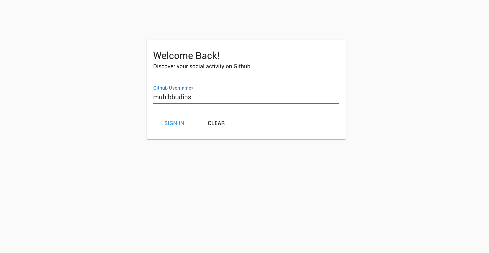

# Github Discover



> Powered by Nuxt.js + Vuetify.js project

### Hi there, welcome to Github Discover

Before we started, basicly this project just for learn about _How to build apps using Nuxt.JS_ and then i use Github API for the web services.

So if you want to help me to build this project together, you can follow below steps :

## Documentations

#### Prerequisite

Make sure you're already installing NodeJS on your computer

#### Installing project

1. Fork this project
2. Clone this project on your account

* Don't forget to star :p

#### Build Setup

``` bash
# install dependencies
$ npm install # Or yarn install

# serve with hot reload at localhost:3000
$ npm run dev

# build for production and launch server
$ npm run build
$ npm start
```

For detailed explanation on how things work, check out the [Nuxt.js](https://github.com/nuxt/nuxt.js) and [Vuetify.js](https://vuetifyjs.com/) documentation.

### Note

Currently i use FREE Github API (using https://api.github.com) so is limited access.

## License

This project under MIT License
